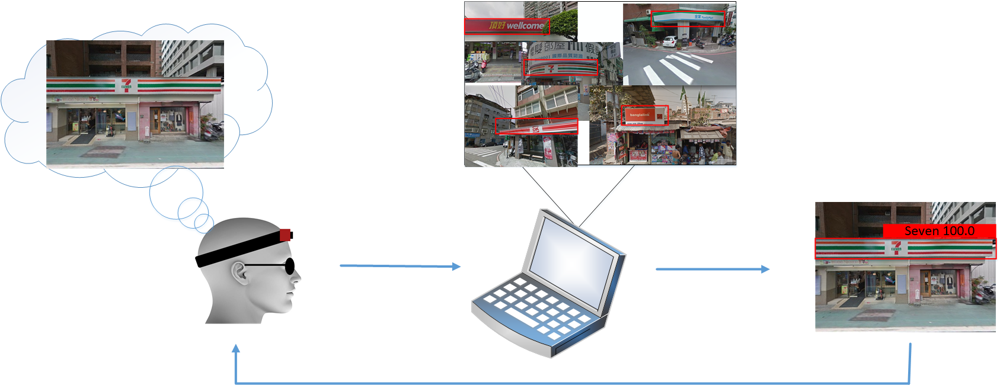
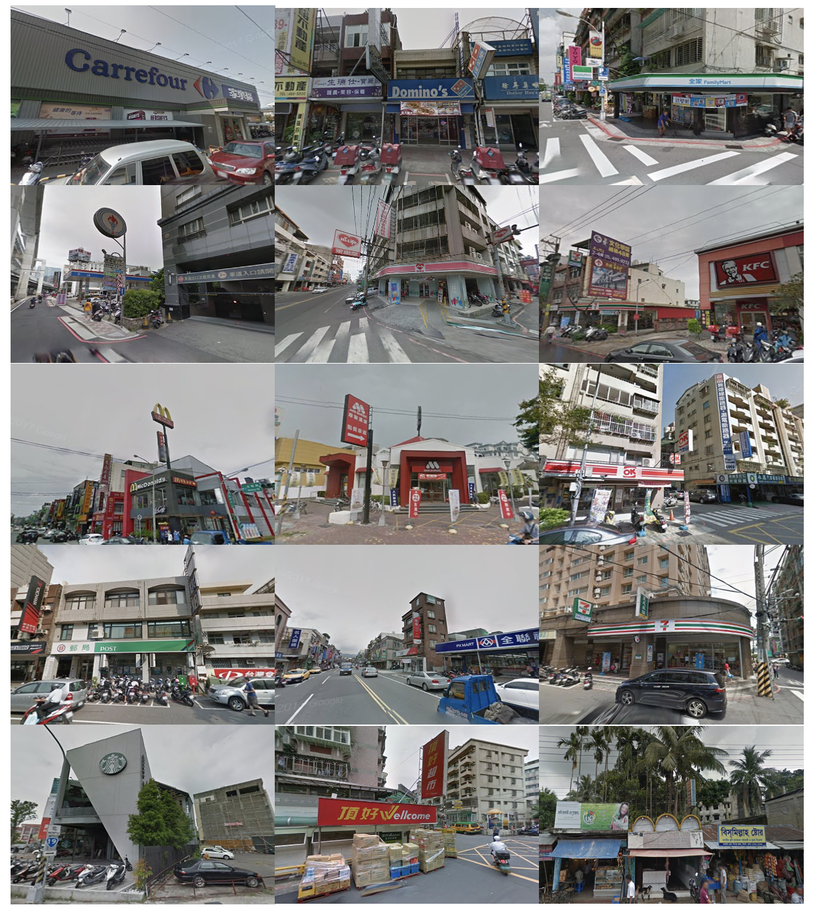

# Signboard Datasets
<!-- Write your comments here 

Domain Adaptation Deep Attention Network for Automatic Logo Detection and Recognition in Google Street View

Ervin Yohannes, Chih-Yang Lin, Timothy K. Shih, Chen-Ya Hong, Avirmed Enkhbat, Fitri Utaminingrum

Department of Computer Science and Information Engineering, National Central University, Taoyuan City 32001, Taiwan

Department of Electrical Engineering, Yuan-Ze University, Taoyuan City 32003, Taiwan

Faculty of Computer Science, University of Brawijaya, Malang City 65145, Indonesia

-->

# Abstract

 Signboards are important location landmarks that provide services to a local community. They are difficult to detect and recognize due to the myriad of designs that combine text and images. Many people only see signboards as sign of place and attract attention of them. However, the impaired visually people can’t see like the usual people about signboards. They need an assistance system to guided them go to destination. Currently, the assistance system still remaining issue since limited datasets to create the best one and also need long computation time for reaches the best results. In this paper, we propose a novel framework that can automatically detect and recognize signboard logos. In addition, we utilizing Google street view for collecting our datasets in around Taiwan’s street. This framework consists of a domain adaptation that not only reduces the loss function between source-target datasets but also represents important source features adopted by the target dataset and deep learning techniques for the detection and recognition system. In our model, we add nonlocal blocks and attention mechanisms called deep attention networks to achieve the best final result. We perform extensive experiments on both our and public datasets to show superior performance and effectiveness of our proposed method. The experimental results show our proposed method outperform the baseline in all evaluation metrics of state-of-the-art detection and recognition method.

# Overview
our dataset is a signboard dataset containing 29,727 images with VOC annotation format and a resolution of 500 × 400 pixels. Our dataset consists of 14 classes of store logos, including Carrefour, Domino, Family Mart, Gas, Hi-Life, KFC, McDonald, Mos Burger, Ok Mart, Post, Pxmart, 7-ELEVEN, Starbucks, and Wellcome. We already divided our datasets into training and validation.

# Download
The link for download the datasets and annotations as follow :

<a href="https://drive.google.com/drive/folders/1tElCRmh5O18gq_iTTMrTlSwgH1zvJKmV?usp=sharing">Download Datasets</a>

# Results
The comparison results for SSD, YOLOv2, YOLOv3, YOLOv4, and our proposed method are shown in below
<table style="width:100%">
  <tr>
    <th>SSD</th>
    <th>YOLOv2</th>
    <th>YOLOv3</th>
    <th>YOLOv4</th>
    <th>Our proposed method I</th>
    <th>Our proposed method II</th>
  </tr>
  <tr>
    <td></td>
    <td></td>
    <td></td>
    <td></td>
    <td></td>
    <td></td>
  </tr>
  <tr>
    <td>Eve</td>
    <td>Jackson</td>
    <td>94</td>
  </tr>
</table>

# Citation
If you use this dataset in your research, please include the following citation in any published results.
